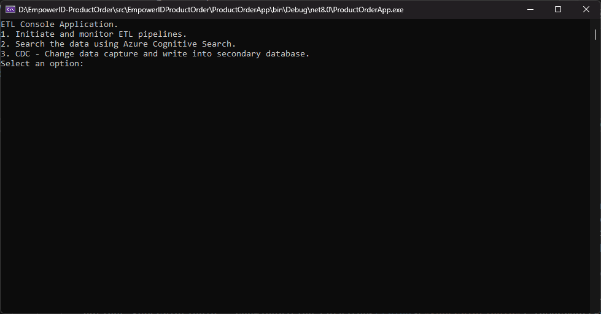

# EmpowerID - ProductOrder - Task


## Getting Started

### Dependencies

* .NET Core 8.x.x
* Microsoft Visual Studio Enterprise 2022 (64-bit) - Current - Version 17.9.5


### Build and run the Application

```
1. Make sure .NET Core 8.x.x has been installted.
2. Open EmpowerIDProductOrder.sln solution file in Visual Studio. You can find the file in the src/EmpowerIDProductOrder folder.
3. Make sure the startup project is ProductOrderApp project.
4. Now run the application and below screen will show up.
```    

* Now follow the instruction on the screen.


